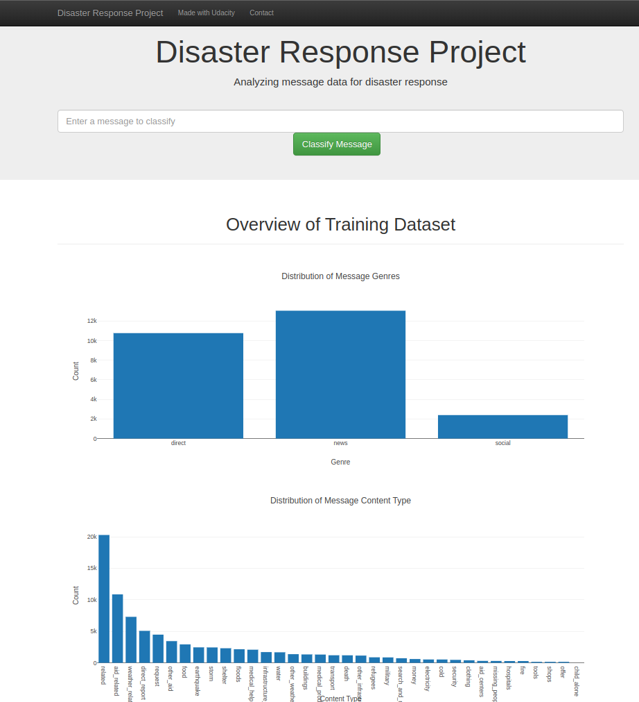
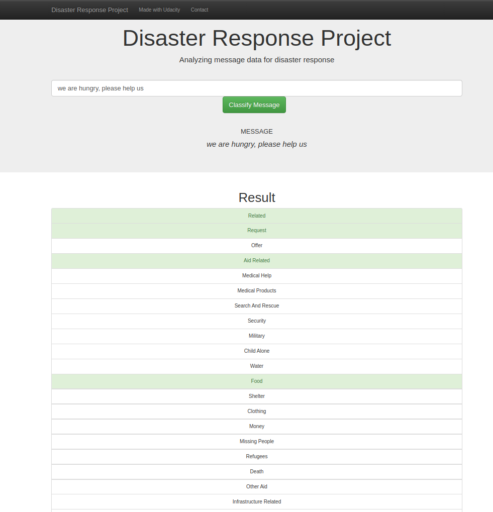

# Disaster Response Pipeline Project

### Table of Contents

- [Disaster Response Pipeline Project](#disaster-response-pipeline-project)
    - [Table of Contents](#table-of-contents)
  - [Project Motivation](#project-motivation)
  - [Installation ](#installation-)
  - [Data](#data)
    - [Data Advise](#data-advise)
  - [File Descriptions ](#file-descriptions-)
  - [Instructions:](#instructions)
  - [Licensing, Authors, Acknowledgements](#licensing-authors-acknowledgements)
  - [Next Possibles Steps](#next-possibles-steps)

## Project Motivation

This project analyses tweets to identify disasters. 

## Installation 

* [Python 3] - All code and notebooks were develop in python 3.8
* [Jupyter Notebook] - jupyter notebook is an open source and used to data analyze with python code
* [Pandas] - uses to clean, organize, convert, and merge the data.
* [SqlAlchemy] - uses to create, connect and manipulate database.
* [nltk] - uses to process text data
* [numpy] - is a fundamental scientific computing.
* [pickle] and [joblib] -  uses to load and dump models
* [sklearn] - uses for ML tasks
* [flask] - uses to create web app
* [plotly] - uses to create data analyzation on web app.

## Data 
The data for this project is Tweets cataloged by Figure eight as disaster-related, it informs what type of disaster a tweet is related to.

The categories present on dataset is:

- Related: Is related to a disaster 
- Request: Request something
- Offer: Offer something
- Aid Related: Is related whit Aid
- Medical Help: Related whit medical help.
- Medical Products: Related whit Medical products.
- Search And Rescue: Related whit Search And Rescue
- Security: Related whit Security
- Military: Related whit Military
- Child Alone: Related whit Child Alone
- Water: Related whit Water
- Food: Related whit Food
- Shelter: Related whit Shelter
- Clothing: Related whit Clothing
- Money: Related whit Money
- Missing People: Related whit Missing People
- Refugees: Related whit Refugees
- Death: Related whit Death
- Other Aid: Related whit Other Aid
- Infrastructure Related: Related whit Infrastructure Related
- Transport: Related whit Transport
- Buildings: Related whit Buildings
- Electricity: Related whit Electricity
- Tools: Related whit Tools
- Hospitals: Related whit Hospitals
- Shops: Related whit Shops
- Aid Centers: Related whit Aid Centers
- Other Infrastructure: Related whit Other Infrastructure
- Weather Related: Related whit Weather Related
- Floods: Related whit Floods
- Storm: Related whit Storm
- Fire: Related whit Fire
- Earthquake: Related whit Earthquake
- Cold: Related whit Cold
- Other Weather: Related whit Other Weather
- Direct Report: Related whit Direct Repor

### Data Advise

Is important to say that this dataset is imbalanced (ie some labels like water have few examples). This imbalance could be affected the precision and recall of some categories. 

If you know where I can find more data, contact me!! <3

## File Descriptions 

There are 4 important folders in this project:
    - notebooks: Jupyter notebooks used to prototype the code.
    - data: Data CSVs and ETL python code.
    - models: ML pipeline code.
    - app: Flask web app
  
## Instructions:
1. Run the following commands in the project's root directory to set up your database and model.

    - To run ETL pipeline that cleans data and stores in database
        `python data/process_data.py data/disaster_messages.csv data/disaster_categories.csv data/DisasterResponse.db`
    - To run ML pipeline that trains classifier and saves
        `python models/train_classifier.py data/DisasterResponse.db models/classifier.pkl`

2. Run the following command in the root's directory to run your web app.
    `python app/run.py`

3. Go to http://0.0.0.0:3001/

## Licensing, Authors, Acknowledgements

This code uses the MIT License. feel free to use the code as you would like!

## Next Possibles Steps

- Go into more detail about the dataset and your data cleaning and modeling process in your README file, add screenshots of your web app and model results.
- Add more visualizations to the web app.
- Based on the categories that the ML algorithm classifies text into, advise some organizations to connect to.
-Customize the design of the web app.
-Deploy the web app to a cloud service provider.
-Improve the efficiency of the code in the ETL and ML pipeline.
